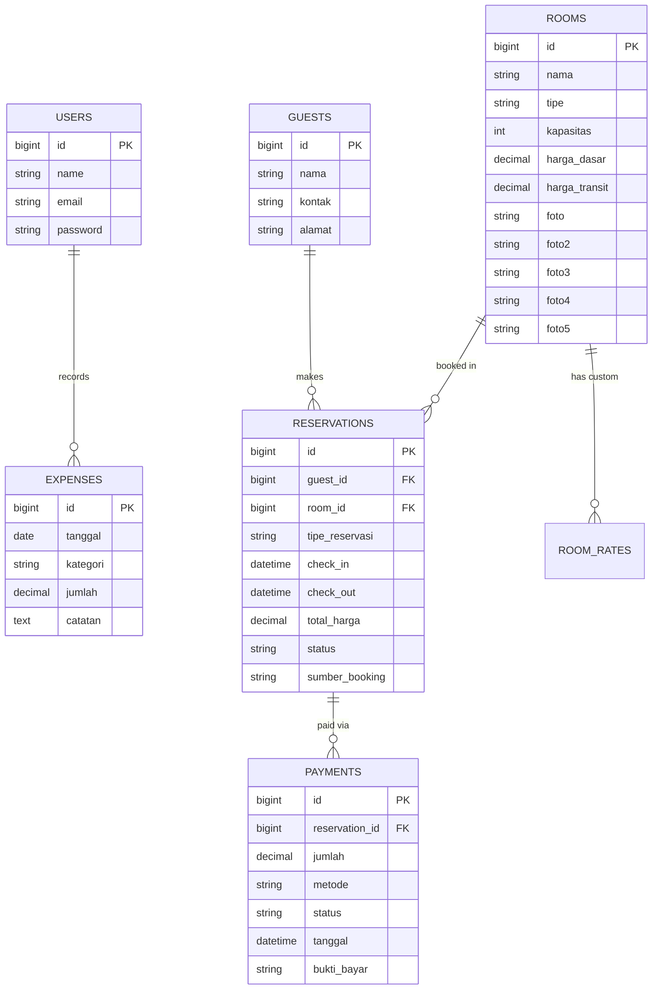

<div align="center">

# 🏖️ Teras Abah Homestay — End-to-End Hospitality & Reservation Management System

**Sistem Informasi Manajemen Reservasi & Operasional Homestay Berbasis Web**

[](https://laravel.com)
[](https://php.net)
[](https://tailwindcss.com)
[](https://alpinejs.dev)
[](https://www.mysql.com/)
[](LICENSE)

<p align="center">
  <b>Solusi digital terintegrasi untuk bisnis akomodasi tepi pantai: pemesanan real-time, validasi anti double-booking cerdas, manajemen sewa harian & transit 6 jam, serta analitik keuangan komprehensif.</b>
</p>

[Fitur Utama](#-fitur-utama) • [Keunggulan Rekayasa Sistem](#-keunggulan-rekayasa-sistem-engineering-highlights) • [Arsitektur & Skema](#-arsitektur--skema-database) • [Instalasi](#-panduan-instalasi-lokal) • [Deployment](#-deployment-hostinger)

</div>

---

## 📌 Ringkasan Portofolio (About The Project)

**Teras Abah Homestay** adalah sistem aplikasi web *hospitality management* yang dikembangkan untuk memecahkan tantangan operasional nyata pada bisnis penginapan:
- **Pemesanan Ganda (*Double-Booking*)**: Mencegah tabrakan jadwal antar tamu secara otomatis.
- **Fleksibilitas Sewa Singkat (*Transit 6 Jam*)**: Mengizinkan penjualan kamar sebelum tamu menginap harian tiba di hari yang sama tanpa bentrok jam.
- **Otomatisasi Status Check-Out Jam 12:00 Siang**: Melepas status kamar menjadi *Ready* secara *real-time* tanpa perlu input manual admin.
- **Dual Payment Flow**: Mendukung tamu yang ingin *Bayar di Tempat (Tunai)* tanpa hambatan upload bukti, maupun *Transfer Bank / QRIS*.
- **Transparansi Finansial**: Melacak laba bersih secara otomatis (Omset Kamar dikurangi Pengeluaran Operasional) dan mengidentifikasi kamar terlaris (*Top Selling Rooms*).

---

## ✨ Fitur Utama

### 👤 Portal Pengunjung / Tamu (Guest Experience)
- **Katalog Kamar Interaktif**: Galeri multi-foto (hingga 5 foto per kamar), daftar fasilitas lengkap, dan kapasitas tamu.
- **Dual Mode Reservasi**:
  - 🌙 **Menginap Harian**: Perhitungan tarif dinamis otomatis berdasarkan jumlah malam (`harga_dasar * nights`).
  - ⏱️ **Transit (6 Jam)**: Tarif sewa 6 jam fleksibel dengan jam check-in kustom.
- **Smart Timepicker & Datepicker**: Menggunakan Flatpickr yang disinkronkan dengan jam operasional dan memblokir tanggal lampau.
- **Pilihan Metode Pembayaran Ganda**:
  - 💵 **Bayar di Tempat (Tunai / COD)**: Tamu cukup mengisi data diri; reservasi langsung masuk sistem tanpa wajib upload bukti transfer.
  - 💳 **Transfer Bank / QRIS**: Pembayaran daring dengan verifikasi slip transfer.
- **Integrasi WhatsApp Real-Time**: Floating button dan tautan konfirmasi instan ke admin dengan pesan template otomatis.

### 🛡️ Dashboard Pengelola (Admin Portal - StayManager UI)
- **Monitoring Okupansi Real-Time**:
  - 🟢 **Active Stays**: Menghitung tamu yang sedang aktif menempati kamar saat ini.
  - 🟣 **Check-out Hari Ini**: Penanda khusus tamu yang dijadwalkan pulang hari ini.
  - 🔵 **Upcoming Stays**: Hitungan mundur kedatangan tamu berikutnya (terkonversi rapi dalam jam atau hari).
  - 🟡 **Pending Payments**: Verifikasi pembayaran yang masuk.
- **Pencegahan Bentrok (*Collision Detection Engine*)**: Algoritma cerdas yang menolak pesanan jika rentang waktu bertabrakan dengan pesanan aktif lain.
- **Manajemen Reservasi Walk-In (Manual)**: Fitur input tamu offline dengan opsi **Harga Nego/Custom** di bawah tarif standar.
- **Manajemen Aksi Cepat**: Verifikasi pembayaran, penolakan (*Reject*), percepatan check-out (*Early Check-out*), dan penghapusan data.
- **Manajemen Kamar (CRUD)**: Pengaturan kamar, harga dasar, harga transit, fasilitas, dan manajemen 5 slot foto.
- **Pelacak Pengeluaran Operasional (Expense Tracker)**: Catatan biaya operasional harian (listrik, air, laundry, kebersihan).
- **Laporan & Analitik Keuangan**:
  - 🏆 **Analisis Kamar Terlaris**: Peringkat kamar (🥇 #1, 🥈 #2, 🥉 #3) berdasarkan omset dan persentase kontribusi terhadap total pendapatan.
  - 📈 **Kalkulasi Laba Bersih**: Total Pemasukan Reservasi dikurangi Total Pengeluaran.
  - 🖨️ **Ekspor & Cetak**: Format cetak ramah printer (*Print-Ready*) dan ekspor ke **CSV Spreadsheet**.

---

## ⚡ Keunggulan Rekayasa Sistem (Engineering Highlights)

### 1. Algoritma Strict Anti Double-Booking & Slot Berbatasan
Tantangan bisnis: *Bagaimana mengizinkan kamar disewa transit 6 jam (misal 08:00 - 14:00) pada hari yang sama dengan tamu yang menginap (14:00 - besok 12:00)?*

```php
// app/Models/Room.php
public function isAvailable($checkIn, $checkOut, $excludeReservationId = null)
{
    $checkInDt  = Carbon::parse($checkIn);
    $checkOutDt = Carbon::parse($checkOut);

    return !$this->reservations()
        ->whereIn('status', ['Pending', 'Confirmed', 'Checked-in'])
        ->when($excludeReservationId, fn($q, $id) => $q->where('id', '!=', $id))
        ->where(function ($query) use ($checkInDt, $checkOutDt) {
            // Strict temporal overlap: A bentrok B hanya jika A.check_in < B.check_out DAN A.check_out > B.check_in
            // Slot yang tepat berbatasan (A.check_out == B.check_in) dinyatakan DIIZINKAN!
            $query->where('check_in', '<', $checkOutDt)
                  ->where('check_out', '>', $checkInDt);
        })
        ->exists();
}
```

### 2. Status Kamar Otomatis Jam 12:00 Siang Real-Time
Status kamar beralih dari `Terisi` ke `Tersedia (Ready)` secara dinamis saat waktu server melewati batas checkout (12:00 WIB) pada tanggal check-out tanpa memerlukan intervensi manual atau cron job berlebih.

```php
// app/Models/Room.php
public function isOccupiedNow()
{
    $now = Carbon::now(); // Timezone: Asia/Jakarta

    return $this->reservations()
        ->whereIn('status', ['Pending', 'Confirmed', 'Checked-in'])
        ->where(function ($query) use ($now) {
            $query->where('check_in', '<=', $now)
                  ->where(function ($q) use ($now) {
                      $q->where(fn($sub) => $sub->whereDate('check_out', '>', $now->toDateString()))
                        ->orWhere(fn($sub) => $sub->whereDate('check_out', '=', $now->toDateString())
                                                  ->whereRaw("? < '12:00:00'", [$now->format('H:i:s')]));
                  });
        })
        ->exists();
}
```

### 3. Dual Payment Architecture
Mencegah pelanggaran constraint database dengan memisahkan kolom status pembayaran yang sesuai standar enum, sekaligus memberikan fleksibilitas UX untuk pesanan *Cash On Arrival*.

---

## 🏛️ Arsitektur & Skema Database



---

## 🛠️ Tech Stack & Dependencies

| Lapisan | Teknologi | Kegunaan |
| :--- | :--- | :--- |
| **Backend Core** | **Laravel 11 / 12 (PHP 8.2+)** | Arsitektur MVC, Eloquent ORM, CSRF Shield, Query Builder |
| **Database** | **SQLite (Dev) / MySQL (Prod)** | Penyimpanan relasional transaksi dan audit reservasi |
| **Frontend Framework** | **Tailwind CSS + Blade Engine** | Antarmuka adaptif, modern, dan ringan |
| **Client-side Interactivity** | **Alpine.js & Flatpickr** | Modal interaktif, kalender pemilihan tanggal/jam dinamis |
| **Icons & Typography** | **Plus Jakarta Sans & Material Symbols** | Tampilan visual profesional berstandar hospitality |
| **Production Target** | **Hostinger Shared Hosting** | Penyesuaian document root `public/` & optimasi cache |

---

## 🚀 Panduan Instalasi Lokal (Quick Start)

### 1. Prasyarat
- PHP >= 8.2 (ekstensi: `pdo`, `pdo_sqlite` / `pdo_mysql`, `mbstring`, `openssl`, `curl`)
- Composer terpasang di sistem
- Git

### 2. Kloning & Dependensi
```bash
git clone https://github.com/iuss26/websiteapphomestay.git
cd websiteapphomestay
composer install
```

### 3. Konfigurasi Lingkungan
```bash
cp .env.example .env
php artisan key:generate
```

Pastikan pengaturan zona waktu di `.env`:
```env
APP_TIMEZONE=Asia/Jakarta
DB_CONNECTION=sqlite
```
*(Atau gunakan `mysql` jika menggunakan XAMPP/MySQL).*

### 4. Database & Storage Link
```bash
# Sentuh file SQLite jika menggunakan SQLite
touch database/database.sqlite

# Migrasi tabel database
php artisan migrate

# Hubungkan symlink storage untuk foto kamar & bukti bayar
php artisan storage:link
```

### 5. Buat Akun Admin (Tinker)
```bash
php artisan tinker
```
```php
\App\Models\User::create([
    'name' => 'Admin Teras Abah',
    'email' => 'admin@terasabah.com',
    'password' => bcrypt('AdminTeras2026!')
]);
exit;
```

### 6. Jalankan Server Development
```bash
php artisan serve
```
Akses di browser:
- **Portal Tamu**: `http://127.0.0.1:8000`
- **Login Admin**: `http://127.0.0.1:8000/login`
  - Email: `admin@terasabah.com`
  - Sandi: `AdminTeras2026!`

---

## 🌐 Deployment (Hostinger Production Guide)

Project ini telah disesuaikan agar kompatibel penuh dengan lingkungan **Hostinger Shared Hosting** tanpa memerlukan runtime Node.js:
1. Upload folder project ke `public_html`.
2. Arahkan **Document Root** domain ke `/public_html/public`.
3. Jalankan `php artisan storage:link` dan `php artisan optimize:clear` via SSH Web Terminal.

---

## 👨‍💻 Kontributor & Pengembang

Dikembangkan oleh **Yuslani** ([@iuss26](https://github.com/iuss26))  
*Full-Stack Web Developer & Tech Enthusiast*

---

## 📄 Lisensi

Proyek ini dirilis di bawah lisensi [MIT License](LICENSE). Bebas digunakan untuk keperluan pembelajaran dan portofolio.
